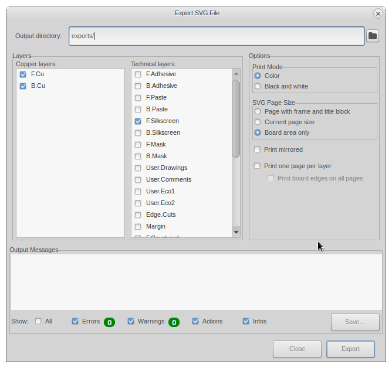
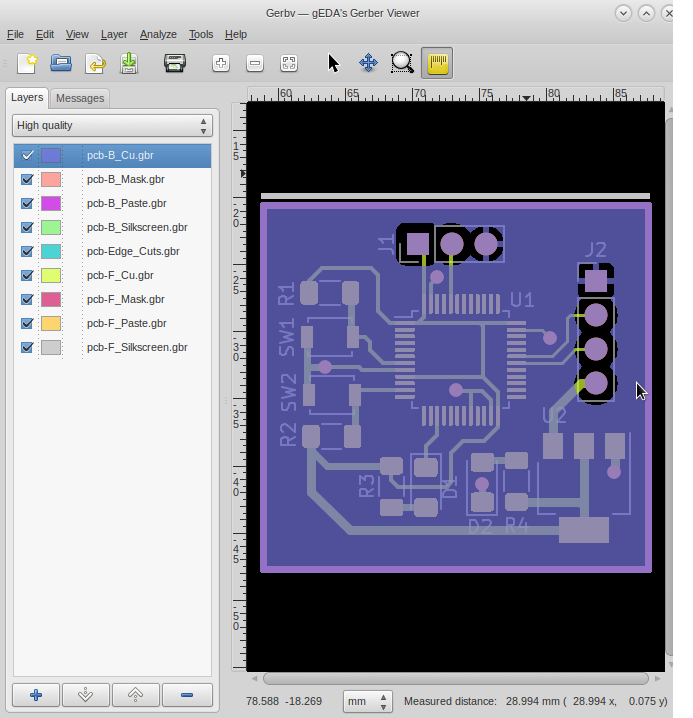

# KiCAD PCB Summary

## Drawing

### Create Export Folder

create **export** to store all exported files

```sh
mkdir -p exports/
```

### Schematic

To generate schematic PDF:

```
Schematic Editor: File -> Plot
```


In this example, resulted file renamed as **sch.pdf**

### PCB Layout

To generate layout PDF using Board2PDF extension:

```
PCB Editor: Tools -> External Plugins -> Board2Pdf
```

In this example, resulted file renamed as **pcb.pdf**

### 3D View

To generate 3D View as PNG image in **exports** folder:

```
PCB Editor: View -> 3D Viewer
```


Then using Imagemagick, convert this PNG to PDF:

```sh
convert pcb3d.png pcb3d.pdf
```

### Wiring

First, generate PCB as SVG file in **exports** folder:

```
PCB Editor: File -> Export -> SVG
```



Use the the result SVG to draw wiring using other CAD software, such as LibreCAD:


Last, generate PDF from LibreCAD:


### Merge PDFs

Merge all PDFs into single file named **summary.pdf**:

```sh
pdfjam --outfile summary.pdf --paper a5paper --landscape \
pcb3d.pdf sch.pdf pcb.pdf wiring.pdf 
```

## Fabrication

### Gerbers

First create subfoler named **gerber**:

```sh
mkdir -p exports/gerber/
```

Then, generate Gerber files into that subfolder:

```
PCB Editor: File -> Fabrication Outputs -> Gerbers
```


You can view Gerber result in KiCAD's Gerber Viewer or [GerbV](https://github.com/gerbv/gerbv).



#### Board Size

Check board size from Gerber Job file

```sh
jq -M -r '.[].Size' exports/gerber/*.gbrjob 2> /dev/null
```

## Bill Of Material

Generate Bill of Material as CSV file into **exports** folder:

```
PCB Editor: File -> Fabrication Outputs -> BOM
```
