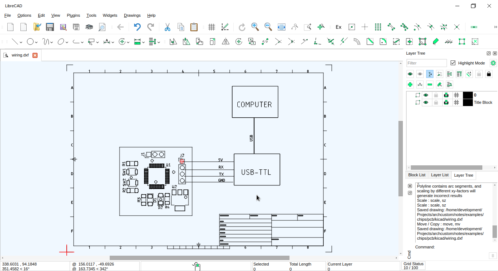

# KiCAD PCB Summary

## Drawing

### Create Plot Folder

create **plots** to store all plotted files

```sh
mkdir -p plots/
```

### Schematic

To generate schematic Landscape A4 PDF:

```
Schematic Editor: File -> Plot
```


In this example, resulted file renamed as **sch.pdf** in **plots** folder.

### PCB Layout

To generate layout PDF using Board2PDF extension:

```
PCB Editor: Tools -> External Plugins -> Board2Pdf
```


In this example, resulted file renamed as **brd.pdf** in **plots** folder.

### Wiring

First, generate PCB as **brd.svg** file in **plots** folder:

```
PCB Editor: File -> Export -> SVG
```


Use the the result SVG to draw wiring using other CAD software, such as LibreCAD:



Last, generate PDF from LibreCAD:

```
LibreCAD: File -> Export PDF -> Print
```

Choose **No** for fitting resize and rename the result to **wiring.pdf**.


### Merge PDFs

Merge all PDFs into single file named **summary.pdf**:

```sh
pdfjam --outfile summary.pdf \
--paper a5paper --landscape \
sch.pdf brd.pdf wiring.pdf 
```

## Fabrication

### View 3D

To get 3D View:

```
PCB Editor: View -> 3D Viewer
```


### Gerbers

First create subfoler named **gerber**:

```sh
mkdir -p plots/gerber/
```

Then, generate Gerber files into that subfolder:

```
PCB Editor: File -> Fabrication Outputs -> Gerbers
```


You can view Gerber result in KiCAD's Gerber Viewer or [Tracespace](https://github.com/tracespace/tracespace).


#### Board Size

Check board size from Gerber Job file

```sh
jq -M -r '.[].Size' plots/gerber/*.gbrjob 2> /dev/null
```

## Bill Of Material

Generate Bill of Material as CSV file into **plots** folder:

```
PCB Editor: File -> Fabrication Outputs -> BOM
```
